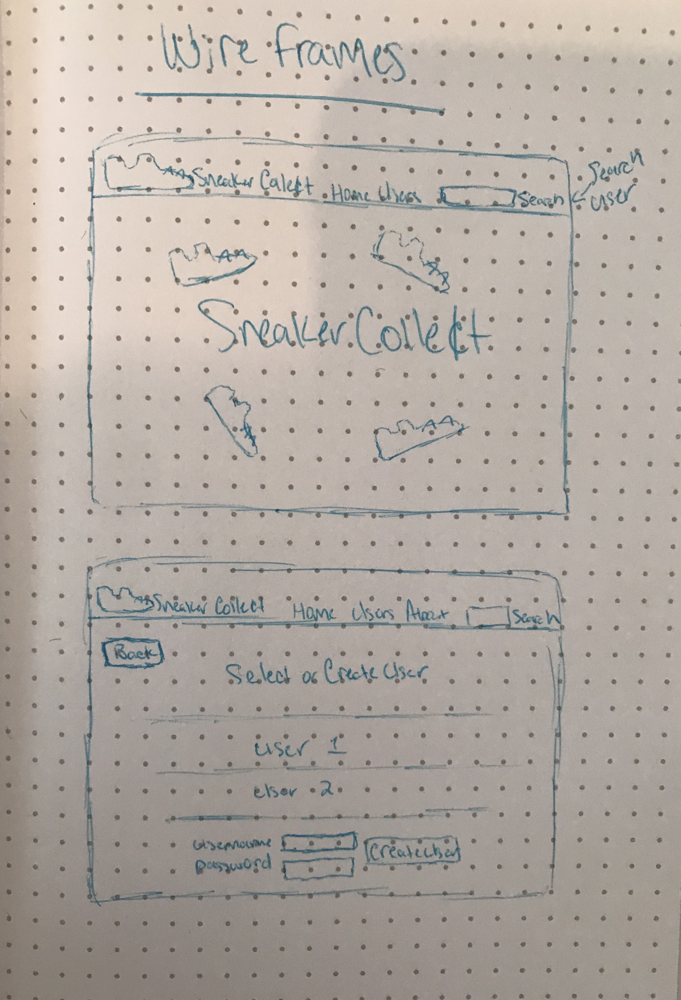
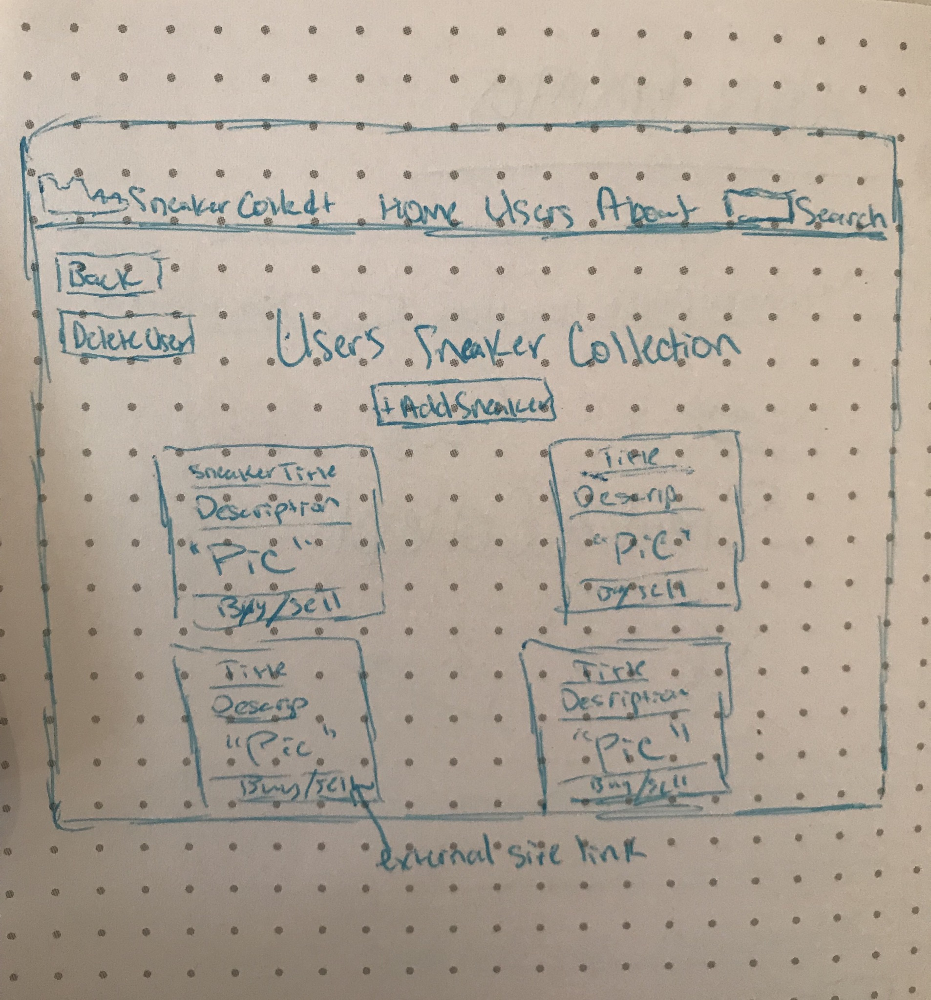
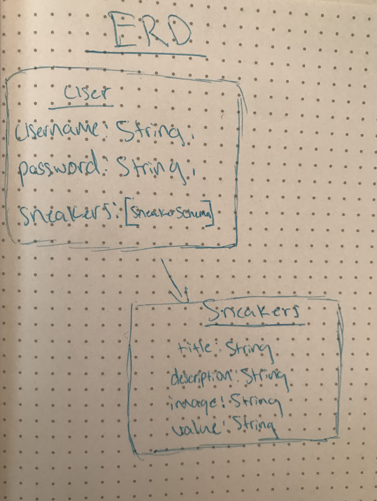
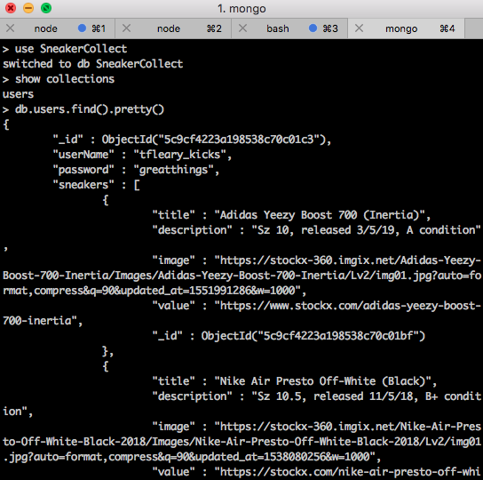
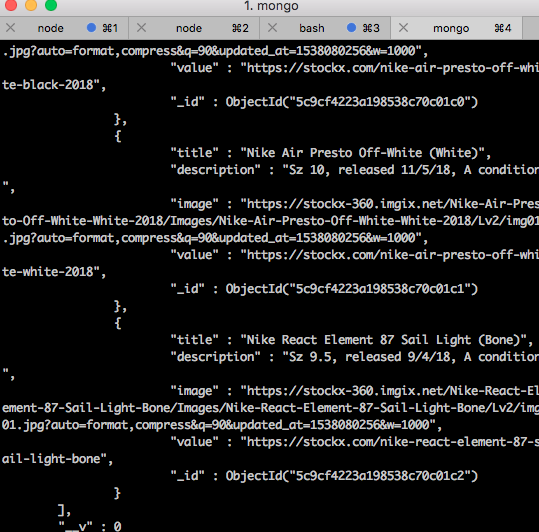

# Sneaker Collect (Sneaker Collection App)

This application is to help users keep track of their sneaker collections, along with competing with the collections of others(e.g. total value, rarity of sneaker, etc). New users can be added or deleted, while each user is able to add, edit, and delete sneakers in thier collections *New Features in Production*

## Technologies Used:
____
* Visual Studio Code
* Mongo, Express, React, Node.js (MERN Stack)
* Javascript (Main Language Used: 91% of code)
* Bootstrap, Styled-Components, CSS, Google Fonts (Styling)

## Wireframes :
____

## ERD :
___

## Live Deployed Project Link & Trello Board(User Stories)
___
[Heroku](https://sneakercollecct.herokuapp.com/)

[Trello](https://trello.com/b/fZjruLsL/sneaker-collector)

## Local Created Api(Mongo Data)
____

* Showcasing mongo competance and skills, called local api with axios

## Features
___

### Current 

* Admin can add and delete users
* User can create, edit, update, and delete sneakers in their collection
* User can be directed to external site StockX to buy or sell a sneaker 
* User can be directed to external site StockX to see the current value of that sneaker

### New Features

* Each user can have their own login authentication
* Each user's collection can have multiple pictures for each pair of sneakers
* Each user can have a profile picture, along with their total collection value ($) on their profile
* User's can compete to be at the top of the leaderboards (highest value collection, highest value shoe, most popular collection, etc)
* User's can have a "trade" button to request to trade a pair of shoes from another user